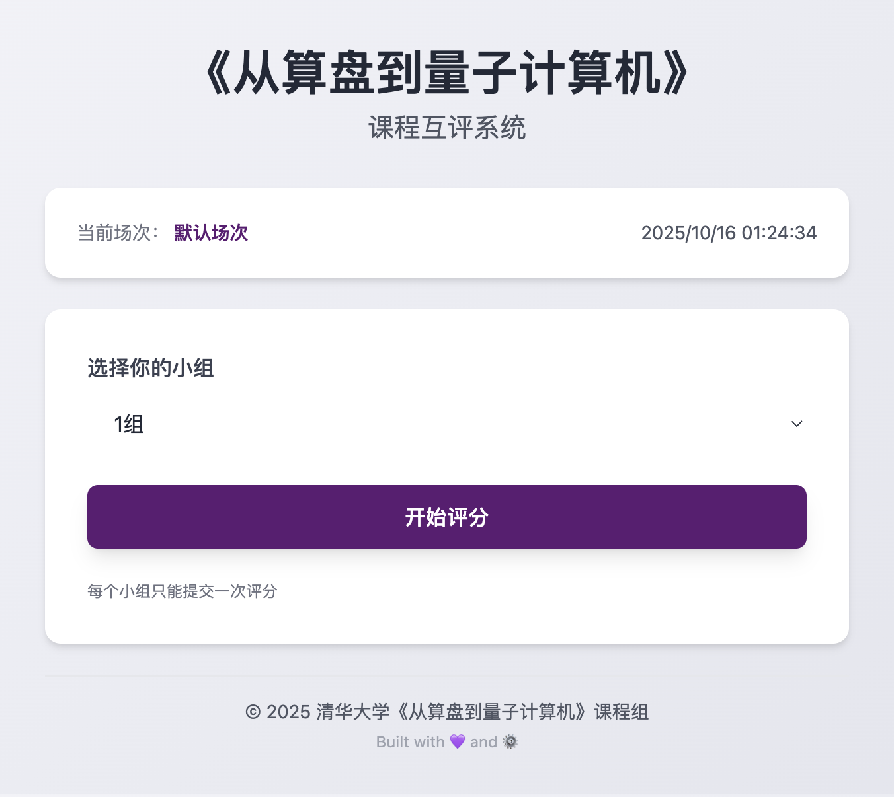

# 🧮 Abacus Ratings（课堂展示互评系统）

本项目是一个轻量的课堂展示互评系统（FastAPI + SQLite），支持评分收集、场次/小组管理、发表顺序、结果汇总与导出。开箱即用，适合各高校课堂现场使用。

> 说明：本项目默认语言为「简体中文」。欢迎社区提交多语言（i18n）支持的 PR！

## 功能特点
- 基于组别的评分（支持解决程度/逻辑性/分析总结等加权项）
- 多场次管理（创建/激活/删除）
- 防重复提交机制（基于锁与提交记录）
- 管理面板：进度查看、异常评分检测、CSV 导出
- 纯 SQLite 存储，无外部依赖，易于部署

<details>
  <summary>界面预览</summary>
  
  
</details>

## 部署方式
### Docker 容器化部署（推荐）
```bash
docker compose up --build
```

访问地址：`http://localhost:8000`

在首页页脚点击齿轮（⚙️）按钮，输入管理员密钥后进入管理面板。

### 变量说明
必填
- `ADMIN_KEY`：管理员密钥，用于首次登录管理面板（首页页脚齿轮⚙️或 `?key=`）。

可选（有默认值，生产建议设置）
- `COURSE_NAME`：课程名称（默认：Course Presentation Ratings）。
- `COURSE_INSTITUTION`：学校/机构名称（留空则页脚隐藏机构）。
- `LOCK_EXPIRY_MINUTES`：锁过期时间（默认：120）。
- `SESSION_SECRET`：会话签名密钥。未设置时系统会自动生成临时值（便于入门）；生产环境强烈建议显式设置强随机值以保持会话稳定。
- `SESSION_COOKIE_NAME`：会话 Cookie 名称（默认：abacus_token）。

### 本地运行（开发调试）
```bash
./start.sh
```
打开 `http://localhost:8000/`。

## 须知
许可详见 `LICENSE`。欢迎提交多语言支持、可访问性改进、部署脚本与 CI 等相关 PR。
